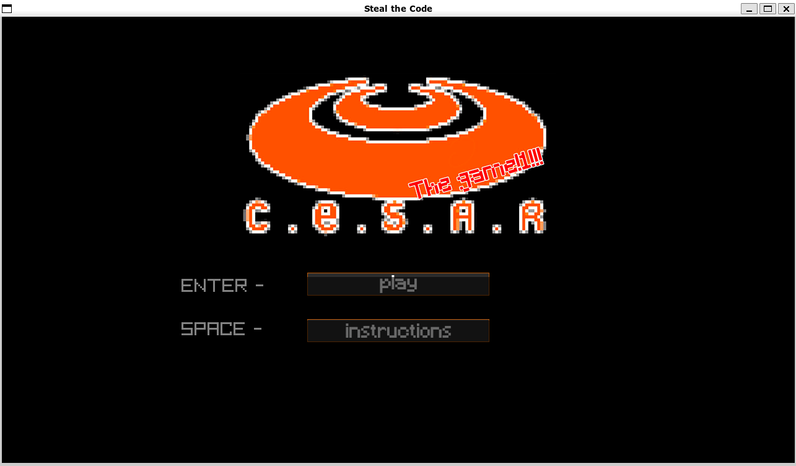
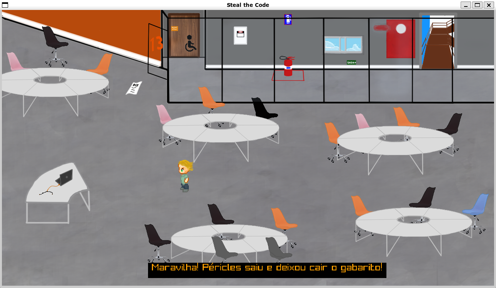
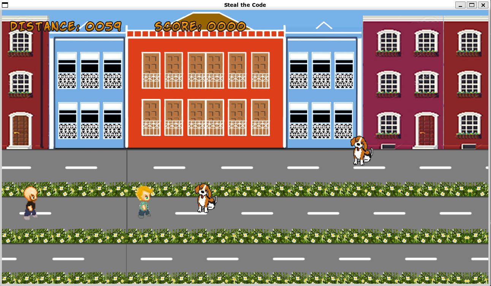
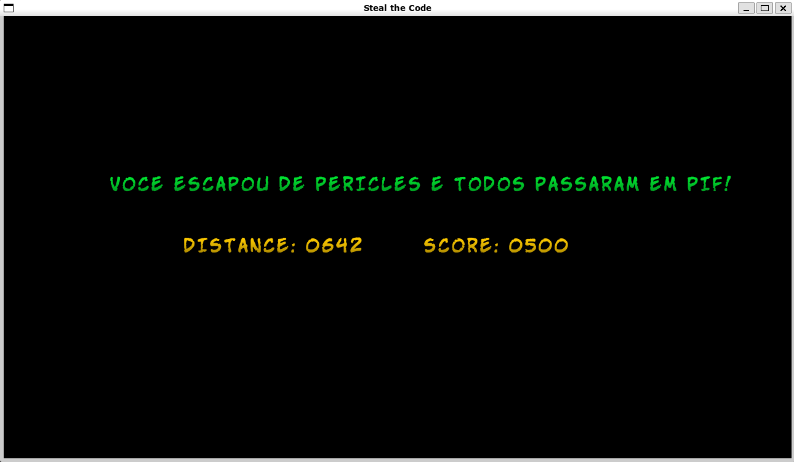
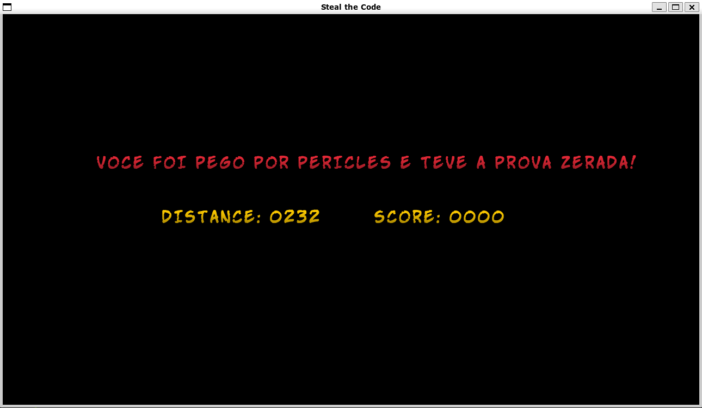

# Game_Steal_The_Code

This is a dedicated repository for the CESAR School's Imperial and Functional Programming course project.

## Table of Contents

- [General Info](#general-info)
- [Technologies](#technologies)
- [Screenshots](#screenshots)
- [Setup](#setup)
- [Run Game](#run-game)
- [Status](#status)
- [Sources](#sources)
- [Team](#team)

## General Info

This is a project where our team created a game using the libray Raylib. The game consists in the main caracter stealing the anserws of the Test and trying to escape the Teacher.

## Technologies

Project is created with:

- C/C++ gcc
- Raylib
- WSL Linux

## Screenshots

### 

### 

### 

### 

### 

### 

### 

## Setup

First, you'll need to have the latest version of [Raylib](https://github.com/raysan5/raylib/wiki/Working-on-GNU-Linux) installed for Linux. (Their is for Windows and Mac too)

To run this project, you'll also need WSL-Linux, simply enter this command in CMD:

A Recomend you to install WSL from the Microsoft Store if your computer is Windows and setup it to run the project.

After you install everything, run this command to build the project

```
cc main.c -lraylib -lGL -lm -lpthread -ldl -lrt -lX11
```

## Run Game

To run the game open your Terminal Linux(WSL) and find the directory that containes the Project!

Now use this commad:

```
./a.out
```

## Status

Project is: In progress. We have future plans to extend the game!

- Main Code: Done
- Extend: in progress.

## Sources

- This project was inspired by [Raylib](https://www.raylib.com/examples.html) examples.

## Team

| Student           | Contact                    |
| ----------------  | -------------------------- |
| Flávio Vieira     | flaviotefilho@gmail.com    |
| Gabriel Grinspun  | diegoovmoura@gmail.com     |
| Gabriel Parísio   | diegoovmoura@gmail.com     |
| Julio Coutinho    | diegoovmoura@gmail.com     |
| Luís Cruz         | diegoovmoura@gmail.com     |
| Patrick Catchpole | diegoovmoura@gmail.com     |
| Rafael Alves      | rjhxalves@gmail.com        |